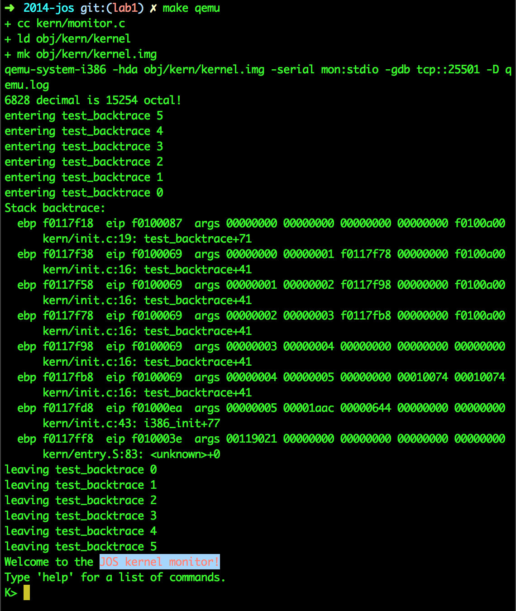
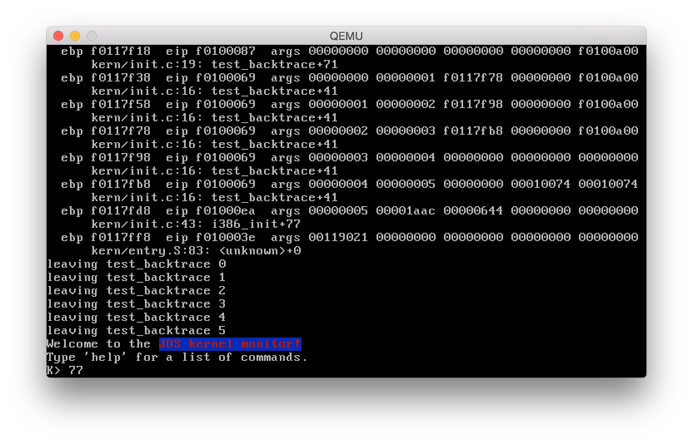

title: Lab 1
author: Leedy

# Lab 1

## Part 1: PC Bootstrap

### Getting Started with x86 assembly

> Exercise 1. Familiarize yourself with the assembly language materials 
> available on the 6.828 reference page. You don't have to read them now, but 
> you'll almost certainly want to refer to some of this material when reading 
> and writing x86 assembly.
> 
> We do recommend reading the section "The Syntax" in Brennan's Guide to 
> Inline Assembly. It gives a good (and quite brief) description of the AT&T 
> assembly syntax we'll be using with the GNU assembler in JOS.

由于在 ICS 课程和微机实验课程上都使用过 x86 汇编，因此这一部分还是比较熟悉的。

### Simulating the x86

这一步开始之前，需要先把环境给配置好。我原来有一个 Ubuntu 的虚拟机，但是没有安装桌面。结果安装了 qemu 之后启动提示找不到 X Window Server（后来想想可能运行 `make qemu-nox` 就可以了）。结果一怒之下决定在 Mac 上配置交叉编译环境。于是就陷入了一个大坑，虽然在 MIT 网站上有 instructions，但在实践过程中出现了以下问题：

1. GCC 4.6.1 无法使用 clang 编译。最后查出来是一个 GCC 的 bug，patch 后成功编译。
2. i386-jos-elf-gcc 不使用 i386-jos-elf-as 与 i386-jos-elf-ld。问题在于后两者是在 binutil 里提供的，而 gcc 在 configure 的时候无法正确找到它们，最后在 configure 时指定 `--with-as= --with-ld=` 解决。
3. lab1 项目 `make gdb` 时找不到 i386-jos-elf-gdb。这个是因为 makefile 里写错了，改正过来就可以了。

最终还是成功在 Mac OS X 平台上跑起来了，安装的代码也写成了一个 [homebrew 脚本](https://github.com/liudangyi/homebrew-i386-jos-elf-gcc)。

### The PC's Physical Address Space

这一部分主要是知识，加深了自己对 MMIO（Memory-Mapped I/O）的认识，以及为什么比尔盖茨说「我们只需要 640 kb 的内存」。

### The ROM BIOS

这一节主要了解了 GDB 的用法（远程调试！）和 CPU 的启动过程（CS 的初值是 0xf000，IP 的初值是 0xfff0）。不过这里有一个问题，就是为什么系统在启动之后，0xffff0 的内容不再是 `ljmp   $0xf000,$0xe05b` 而是变成了 `ljmp   $0x3630,$0xf000e05b`？通过 `watch *0xffff0` 可以发现是指令 `0xffff15fe:  rep movsb %ds:(%esi),%es:(%edi)` 在修改这部分内存，且此时 CR0 的最低位为1。由于此时 Boot Loader 还没有装载（0x7c00 此处内存还为空），可以初步判断 QEMU 的 BIOS 也会进入32位保护模式并访问 1MB 以上的内存。

> Exercise 2. Use GDB's si (Step Instruction) command to trace into the ROM BIOS for a few more instructions, and try to guess what it might be doing. You might want to look at Phil Storrs I/O Ports Description, as well as other materials on the 6.828 reference materials page. No need to figure out all the details - just the general idea of what the BIOS is doing first.

0xfe05b 附近的代码如下

```asm
	 0xfe05b: cmpl   $0x0,%cs:0x6c30
	 0xfe062: jne    0xfd34d
	 0xfe066: xor    %ax,%ax
	 0xfe068: mov    %ax,%ss
	 0xfe06a: mov    $0x7000,%esp
	 0xfe070: mov    $0xf2e17,%edx
	 0xfe076: jmp    0xfd1be
	 0xfe079: push   %ebp
	 0xfe07b: push   %edi
	 0xfe07d: push   %esi
	 0xfe07f: push   %ebx
	 0xfe081: sub    $0xc,%esp
	 0xfe085: mov    %eax,%esi
	 0xfe088: mov    %edx,(%esp)
	 0xfe08d: mov    %ecx,%edi
	 0xfe090: mov    $0xe000,%eax
	 0xfe096: mov    %ax,%es
	 0xfe098: mov    %es:0xf7a0,%al
	 0xfe09c: mov    %al,0xa(%esp)
	 0xfe0a1: and    $0xffffffcc,%eax
	 0xfe0a5: or     $0x30,%eax
	 0xfe0a9: mov    %al,0xb(%esp)
	 0xfe0ae: lea    0xb(%esp),%edx
	 0xfe0b4: mov    $0x1060,%eax
	 0xfe0ba: calll  0xf8cef
	 0xfe0c0: test   %eax,%eax
	 0xfe0c3: jne    0xfe2ad
	 0xfe0c7: calll  0xf77f0
	 0xfe0cd: test   %esi,%esi
	 0xfe0d0: je     0xfe0da
	 0xfe0d2: andb   $0xdf,0xb(%esp)
	 0xfe0d8: jmp    0xfe0e0
	 0xfe0da: andb   $0xef,0xb(%esp)
	 0xfe0e0: lea    0xb(%esp),%edx
	 0xfe0e6: mov    $0x1060,%eax
	 0xfe0ec: calll  0xf8cef
	 0xfe0f2: mov    %eax,%ebx
	 0xfe0f5: test   %eax,%eax
	 0xfe0f8: jne    0xfe296
	 0xfe0fc: cmpl   $0x2ff,(%esp)
```

其实基本看不出来什么。不过通过上部分的分析可以看出，BIOS 干的事情大概如下

1. 设置中断表。
2. 初始化各个段寄存器、各种设备。
3. 寻找可启动设备，装载 Boot Loader

## Part 2: The Boot Loader

> Exercise 3. Take a look at the lab tools guide, especially the section on GDB commands. Even if you're familiar with GDB, this includes some esoteric GDB commands that are useful for OS work.
>
> Set a breakpoint at address 0x7c00, which is where the boot sector will be loaded. Continue execution until that breakpoint. Trace through the code in boot/boot.S, using the source code and the disassembly file obj/boot/boot.asm to keep track of where you are. Also use the x/i command in GDB to disassemble sequences of instructions in the boot loader, and compare the original boot loader source code with both the disassembly in obj/boot/boot.asm and GDB.
>
> Trace into bootmain() in boot/main.c, and then into readsect(). Identify the exact assembly instructions that correspond to each of the statements in readsect(). Trace through the rest of readsect() and back out into bootmain(), and identify the begin and end of the for loop that reads the remaining sectors of the kernel from the disk. Find out what code will run when the loop is finished, set a breakpoint there, and continue to that breakpoint. Then step through the remainder of the boot loader.

`boot/boot.S` 是源代码，因此有一些需要预处理的宏，一些指令也被修改过（尤其是32位寄存器名字）。`obj/boot/boot.asm` 是反编译的结果，和 GDB 调试过程中的代码几乎一致。

GDB 默认装载的 symbol file 是 `obj/kern/kernel`，因此无法直接在 `bootmain` 函数上设置断电，可以通过 `symbol-file` 指令重新装载符号文件。

`readseg` 被调用了三次，第一次将 ELF Header 装载到 0x10000，第二次装载了 kernel 的 text 段，offset 为 0x1000，size 为 0xefa0，内存地址为 0x100000。第三次装载了 data 段，offset 为 0x10000，size 为 0xa944，内存地址为 0x10f000。但根据检查，data 段内容全部为0，因此似乎不装载也可以。

将全部数据装载完后，`bootmain` 函数将调用 0x10000c 处函数进入 kernel。

- At what point does the processor start executing 32-bit code? What exactly causes the switch from 16- to 32-bit mode?

	回答：`boot.S` 第51行，`movl    %eax, %cr0`。

- What is the last instruction of the boot loader executed, and what is the first instruction of the kernel it just loaded?
	
	回答：`0x7d63 <bootmain+88>: call   *0x10018` 和 `0x10000c: movw   $0x1234,0x472`

- Where is the first instruction of the kernel?

	回答：0x10000c

- How does the boot loader decide how many sectors it must read in order to fetch the entire kernel from disk? Where does it find this information?

	回答：从 `ELFHDR->e_phnum` 中获取。
	
### Loading the Kernel

> Exercise 4. Read about programming with pointers in C. The best reference for the C language is The C Programming Language by Brian Kernighan and Dennis Ritchie (known as 'K&R'). We recommend that students purchase this book (here is an Amazon Link) or find one of MIT's 7 copies.
>
> Read 5.1 (Pointers and Addresses) through 5.5 (Character Pointers and Functions) in K&R. Then download the code for pointers.c, run it, and make sure you understand where all of the printed values come from. In particular, make sure you understand where the pointer addresses in lines 1 and 6 come from, how all the values in lines 2 through 4 get there, and why the values printed in line 5 are seemingly corrupted.
>
> There are other references on pointers in C (e.g., A tutorial by Ted Jensen that cites K&R heavily), though not as strongly recommended.
>
> Warning: Unless you are already thoroughly versed in C, do not skip or even skim this reading exercise. If you do not really understand pointers in C, you will suffer untold pain and misery in subsequent labs, and then eventually come to understand them the hard way. Trust us; you don't want to find out what "the hard way" is.

之前计算概论课程在指针上已经折腾的够多了，这次又折腾一次……主要的点就是指针类型的加减。

下面讲的就是 ELF 格式，ELF 格式由 ELF Header、Program Headers、Section Headers、具体每一 Section 的数据几个部分组成。其中 ELF Header 必须是很重要的，Program Headers 记录了运行时需要装载到内存中的 Segments 的信息，而 Section Headers 的主要作用是 debug 与链接时重定位。

另外，`readelf` 某些时候比 `objdump` 更好用。

> Exercise 5. Trace through the first few instructions of the boot loader again and identify the first instruction that would "break" or otherwise do the wrong thing if you were to get the boot loader's link address wrong. Then change the link address in boot/Makefrag to something wrong, run make clean, recompile the lab with make, and trace into the boot loader again to see what happens. Don't forget to change the link address back and make clean again afterward!

修改 0x7C00 后（例如改成 0x7C10），不能正常运行了，第一个错误出在 `lgdt    gdtdesc`。原因是链接时 ld 将 boot.S 的第一行代码当做是 0x7C10，因此所有使用绝对定位的符号（如 `gdtdesc`、`protcseg` 以及后面 `bootmain` 函数）都向后移了 0x10 的距离。而实际装载时却将所有代码装到 0x7C00 的地址上，因此会出错。这里是典型的链接地址要与装载地址相同的例子。此外，这里还可能触发内存对齐，编译器可能会在第一行代码前插入一些 `nop` 操作，但不影响错误发生的原因。

> Exercise 6. We can examine memory using GDB's x command. The GDB manual has full details, but for now, it is enough to know that the command x/Nx ADDR prints N words of memory at ADDR. (Note that both 'x's in the command are lowercase.) Warning: The size of a word is not a universal standard. In GNU assembly, a word is two bytes (the 'w' in xorw, which stands for word, means 2 bytes).
>
> Reset the machine (exit QEMU/GDB and start them again). Examine the 8 words of memory at 0x00100000 at the point the BIOS enters the boot loader, and then again at the point the boot loader enters the kernel. Why are they different? What is there at the second breakpoint? (You do not really need to use QEMU to answer this question. Just think.)

不同的原因是 `bootmain` 函数将 kernel 的 text 段装载到了 0x100000，所以执行之后这部分内存内容会改变。kernel 装载后 0x100000 的内容应该是 `MULTIBOOT_HEADER_MAGIC` 即 0x1BADB002。

## Part 3: The Kernel

### Using virtual memory to work around position dependence

讲了 JOS 的虚存机制。由于还没有进入 Lab 2，现在的页表是完全手写的，在`kern/entrypgdir.c`。
 
CR0 的最高位决定了是否开启分页机制，CR3 存放了页表目录的内存地址。

> Exercise 7. Use QEMU and GDB to trace into the JOS kernel and stop at the movl %eax, %cr0. Examine memory at 0x00100000 and at 0xf0100000. Now, single step over that instruction using the stepi GDB command. Again, examine memory at 0x00100000 and at 0xf0100000. Make sure you understand what just happened.
>
> What is the first instruction after the new mapping is established that would fail to work properly if the mapping weren't in place? Comment out the movl %eax, %cr0 in kern/entry.S, trace into it, and see if you were right.

`movl %eax, %cr0` 执行完后，0xF0100000 开始的内存立即被改变。然后 `mov  $relocated, %eax` 与 `jmp  *%eax` 使用寄存器跳转，直接寻址到 0xF010002F。如果分页没有成功开启，那么 `0xf010002f:  mov    $0x0,%ebp` 将会失败。

### Formatted Printing to the Console

> Exercise 8. We have omitted a small fragment of code - the code necessary to print octal numbers using patterns of the form "%o". Find and fill in this code fragment.

这个最简单，只不过一开始我以为需要先输出一个0……

1. Explain the interface between printf.c and console.c. Specifically, what function does console.c export? How is this function used by printf.c?

	答：暴露了几个 init 函数与 `cputchar`、`getchar`、`iscons` 三个函数。`printf.c` 中使用了 `cputchar` 函数，它将 `cputchar` 包装后作为参数传递给 `vprintfmt`。
	
2. Explain the following from console.c:

		if (crt_pos >= CRT_SIZE) {
				int i;
				memcpy(crt_buf, crt_buf + CRT_COLS, (CRT_SIZE - CRT_COLS) * sizeof(uint16_t));
				for (i = CRT_SIZE - CRT_COLS; i < CRT_SIZE; i++)
						crt_buf[i] = 0x0700 | ' ';
				crt_pos -= CRT_COLS;
		}
	
	答：主要检测输出的字符位置是否超出了屏幕空间。如果超出，则将每一行上移一行，并将最后一行填充为空格。

3. For the following questions you might wish to consult the notes for Lecture 2. These notes cover GCC's calling convention on the x86.

	Trace the execution of the following code step-by-step:

		int x = 1, y = 3, z = 4;
		cprintf("x %d, y %x, z %d\n", x, y, z);

	- In the call to `cprintf()`, to what does `fmt` point? To what does `ap` point?

		答：`fmt` 指向 `"x %d, y %x, z %d\n"`，`ap` 指向

	- List (in order of execution) each call to `cons_putc`, `va_arg`, and `vcprintf`. For `cons_putc`, list its argument as well. For `va_arg`, list what `ap` points to before and after the call. For `vcprintf` list the values of its two arguments.

		答：由于 `va_arg` 无法下断点，因此是通过其他方法得出的。
		
			cprintf (fmt=0xf01017f2 "x %d, y %x, z %d\n")
			cons_putc (c=120)
			cons_putc (c=32)
			va_arg(0xf0116fe4 "\001", int)
			cons_putc (c=49)
			cons_putc (c=44)
			cons_putc (c=32)
			cons_putc (c=121)
			cons_putc (c=32)
			va_arg(0xf0116fe8 "\003", unsigned int)
			cons_putc (c=51)
			cons_putc (c=44)
			cons_putc (c=32)
			cons_putc (c=122)
			cons_putc (c=32)
			va_arg(0xf0116fec "\004", int)
			cons_putc (c=52)
			cons_putc (c=10)

4. Run the following code.

		unsigned int i = 0x00646c72;
		cprintf("H%x Wo%s", 57616, &i);

	What is the output? Explain how this output is arrived at in the step-by-step manner of the previous exercise. Here's an ASCII table that maps bytes to characters.
	
	The output depends on that fact that the x86 is little-endian. If the x86 were instead big-endian what would you set i to in order to yield the same output? Would you need to change 57616 to a different value?
	
	答：输出是「He110 World」。因为57616的16进制表示是 `e110`，而
	`"rld"` 字符串在内存中存放的是 `0x72 0x6c 0x64 0x00`。由于 x86 是小端序，因此 0x00646c72 正好可以打印出 rld。如果换成大端序的电脑就要换为 0x726c6400。57616与端序无关，不用更改。

5. In the following code, what is going to be printed after 'y='? (note: the answer is not a specific value.) Why does this happen?

		cprintf("x=%d y=%d", 3);
		
	答：我的输出结果为 y=1604。原因是 `va_arg` 会按照类型依次去读栈上的内容，3在栈上的地址为 0xf0116fe8，而 0xf0116fec 的内容为 0x00000644，即1604。

6. Let's say that GCC changed its calling convention so that it pushed arguments on the stack in declaration order, so that the last argument is pushed last. How would you have to change cprintf or its interface so that it would still be possible to pass it a variable number of arguments?

	答：由于需要压栈的顺序改变了，除了 `va_arg` 需要将加法改为减法外，函数首先必须要知道 `fmt`的地址，因此必须将 `fmt` 字符串作为最后一个参数。
	
> *Challenge* Enhance the console to allow text to be printed in different colors. The traditional way to do this is to make it interpret ANSI escape sequences embedded in the text strings printed to the console, but you may use any mechanism you like. There is plenty of information on the 6.828 reference page and elsewhere on the web on programming the VGA display hardware. If you're feeling really adventurous, you could try switching the VGA hardware into a graphics mode and making the console draw text onto the graphical frame buffer.

先看 `cons_putc` 函数的代码，发现它调用了 `serial_putc`、`lpt_putc`、`cga_putc` 三个函数，分别对应串口输出、并口输出和 CGA/VGA 输出。其中前两种是 port-mapped IO，最后一种是 memory-mapped IO。通过实验可以发现，我们在终端里的字符是通过串口输出的，而模拟器界面的字符是通过 CGA 输出的，并口输出暂时没有作用。

由于我们用的终端均支持 ANSI escape color，因此如果我们实现的 JOS 也用 ANSI escape color 的话，在终端这部分的输出就可以自然地实现，因此考虑使用 ANSI escape color。

ANSI escape color 用如下的字符串控制颜色 `\033[30;49m`，其中30是字符颜色，49是背景颜色。为此，需要在 `serial_putc` 里增加一个类似于自动机的机制。

代码详见 `console.c`。




	
### The Stack

> Exercise 9. Determine where the kernel initializes its stack, and exactly where in memory its stack is located. How does the kernel reserve space for its stack? And at which "end" of this reserved area is the stack pointer initialized to point to?

内核初始化栈在 `entry.S` 的第77行 `movl	$(bootstacktop),%esp`。其中 `bootstacktop` 在 0xf0117000，`bootstack` 在 0xf010f000，大小为 0x8000 即 32KB。`esp` 被初始化为 `bootstacktop`。

> Exercise 10. To become familiar with the C calling conventions on the x86, find the address of the test_backtrace function in obj/kern/kernel.asm, set a breakpoint there, and examine what happens each time it gets called after the kernel starts. How many 32-bit words does each recursive nesting level of test_backtrace push on the stack, and what are those words?
>
> Note that, for this exercise to work properly, you should be using the patched version of QEMU available on the tools page or on Athena. Otherwise, you'll have to manually translate all breakpoint and memory addresses to linear addresses.

每次打印 %esp 可知，%esp 每次相差 0x20 = 32 Bytes 即8个 words。这 32 Bytes 由以下几部分构成。

1. `call/ret` 将 %eip 压栈，4 Bytes。
2. `f0100040:	55                   	push   %ebp`，4 Bytes。
3. `f0100043:	53                   	push   %ebx`，4 Bytes。
4. `f0100044:	83 ec 14             	sub    $0x14,%esp` 这部分是用来传参的，20 Bytes。

Backtrace 函数无法检测到当前函数的参数数量，原因是在编译后的 text 段本身就不包含除了任何符号信息。那么，能否从 stab 段得出函数原型呢？答案也是不可能，因为 stab 并没有提供函数原型的功能。根据 Google 可知，有一种称为 DWARF 的 debug 信息是包含函数原型的（可以通过 `objdump -W` 查看），而我们在编译时并没有加入 DWARF 信息。

> Exercise 11. Implement the backtrace function as specified above. Use the same format as in the example, since otherwise the grading script will be confused. When you think you have it working right, run make grade to see if its output conforms to what our grading script expects, and fix it if it doesn't. After you have handed in your Lab 1 code, you are welcome to change the output format of the backtrace function any way you like.
>
> If you use read_ebp(), note that GCC may generate "optimized" code that calls read_ebp() before mon_backtrace()'s function prologue, which results in an incomplete stack trace (the stack frame of the most recent function call is missing). While we have tried to disable optimizations that cause this reordering, you may want to examine the assembly of mon_backtrace() and make sure the call to read_ebp() is happening after the function prologue.

Backtrace 的到底长啥样在上面已经说了：打印每个 frame 的 ebp、eip 和前五个 arguments。题目也提示我们使用 `read_ebp()` 函数了，可以看出，`read_ebp()` 返回一个 `uint32_t` 类型。考虑到栈的结构如下

				|      ...........      |
				+-----------------------+
				|      Argument #5      |
				+-----------------------+ 
				|      Argument #4      |
				+-----------------------+ 
				|      Argument #3      |
				+-----------------------+ 
				|      Argument #2      |
				+-----------------------+ 
				|      Argument #1      |
				+-----------------------+ 
				|      Return Addr      |
				+-----------------------+ 
				|        Old %ebp       |  <-- Current %ebp
				+-----------------------+ 
				|      ...........      |

因此只需要打印当前 %ebp，然后再打印当前 %ebp 指向的内存地址后面的6个地址内容即可。最后令 `%ebp = *%ebp`。

使用数组寻址的方式可以简化指针的操作。


> Exercise 12. Modify your stack backtrace function to display, for each eip, the function name, source file name, and line number corresponding to that eip.
>
> In `debuginfo_eip`, where do `__STAB_*` come from? This question has a long answer; to help you to discover the answer, here are some things you might want to do:
> 
> - look in the file `kern/kernel.ld` for `__STAB_*`
> - run `i386-jos-elf-objdump -h obj/kern/kernel`
> - run `i386-jos-elf-objdump -G obj/kern/kernel`
> - run `i386-jos-elf-gcc -pipe -nostdinc -O2 -fno-builtin -I. -MD -Wall -Wno-format -DJOS_KERNEL -gstabs -c -S kern/init.c`, and look at init.s.
> - see if the bootloader loads the symbol table in memory as part of loading the kernel binary.
>
> Complete the implementation of debuginfo_eip by inserting the call to stab_binsearch to find the line number for an address.
>
> Add a backtrace command to the kernel monitor, and extend your implementation of mon_backtrace to call debuginfo_eip and print a line for each stack frame of the form:
>
>     K> backtrace
>     Stack backtrace:
>       ebp f010ff78  eip f01008ae  args 00000001 f010ff8c 00000000 f0110580 00000000
>              kern/monitor.c:143: monitor+106
>       ebp f010ffd8  eip f0100193  args 00000000 00001aac 00000660 00000000 00000000
>              kern/init.c:49: i386_init+59
>       ebp f010fff8  eip f010003d  args 00000000 00000000 0000ffff 10cf9a00 0000ffff
>              kern/entry.S:70: <unknown>+0
>     K> 
>
> Each line gives the file name and line within that file of the stack frame's eip, followed by the name of the function and the offset of the eip from the first instruction of the function (e.g., `monitor+106` means the return eip is 106 bytes past the beginning of monitor).
>
> Be sure to print the file and function names on a separate line, to avoid confusing the grading script.
>
> Tip: printf format strings provide an easy, albeit obscure, way to print non-null-terminated strings like those in STABS tables.	`printf("%.*s", length, string)` prints at most length characters of string. Take a look at the printf man page to find out why this works.
>
> You may find that some functions are missing from the backtrace. For example, you will probably see a call to `monitor()` but not to `runcmd()`. This is because the compiler in-lines some function calls. Other optimizations may cause you to see unexpected line numbers. If you get rid of the `-O2` from GNUMakefile, the backtraces may make more sense (but your kernel will run more slowly).

这一题是比较难的，因为要程序自己去读 stab 段。查看 `kdebug.c` 文件，发现诀窍是在链接时手动加上四个符号 `__STAB_BEGIN__`、`__STAB_END__`、`__STABSTR_BEGIN__`、`__STABSTR_BEGIN__` 用来定位 stab 和 stabstr 段的开始和结束（从来没想过可以这样做）。由于已经提供 `stab_binsearch` 函数，因此根据内存地址来找行号还是比较容易的，依葫芦画瓢即可。

